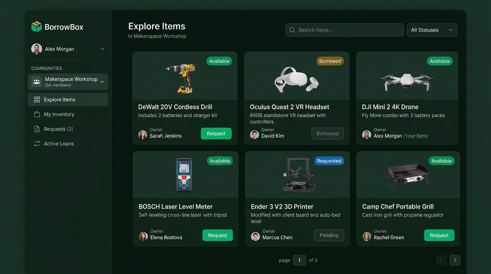

# BorrowBox 📦

> A full-stack platform for sharing and tracking physical items within groups and communities.

[](https://github.com/Furquanis1/BorrowBox/actions/workflows/build.yml)


---

## 📸 Preview



---

## 🌐 Live Demo & Deployment Status

BorrowBox is fully containerized and ready for local or cloud deployment.
- **Local Demonstration:** Ready out-of-the-box using one-click launch scripts (`run_demo.bat` / `run_demo.sh`) or `docker compose up -d --build`.
- **Cloud Deployment:** GitHub Actions CI/CD pipeline ([deploy.yml](.github/workflows/deploy.yml)) is configured for Railway and Render deployment hooks when repository secrets are provided.

---

## 📖 What is BorrowBox?

BorrowBox helps communities, maker spaces, campus labs, and co-living teams manage shared physical assets. Instead of disorganized spreadsheets and informal messaging, BorrowBox provides a structured, auditable borrowing lifecycle:

1. **Catalog & Inventory:** Browse shared items with live status indicators (`AVAILABLE`, `BORROWED`, `ARCHIVED`) and multi-criteria filters.
2. **Borrow Requests:** Borrowers submit requests with custom notes; item owners review, approve, or reject.
3. **Loan Confirmation:** Owners confirm loans with binding due dates, atomically updating item statuses.
4. **Loan Tracking & Returns:** Monitor active and overdue loans, view borrowing history, and reconcile returns with one click.

📄 **Project Pitch & Overview:** See the one-page project pitch in [Markdown](docs/PITCH.md) or download the [Pitch PDF](docs/assets/borrowbox-project-pitch.pdf).

---

## 🚀 Core Features (Implemented in v1)

| Module | Implemented Capabilities |
|---|---|
| **Authentication & Security** | BCrypt password hashing, stateless HttpOnly JWT cookies (XSS-safe), global exception handling, and protected React route guards. |
| **Catalog & Explore** | Live inventory discovery with multi-status filters (`All`, `Available`, `Borrowed`), category filtering, Spring Data JPA Specification search, real-time stats overview, and pagination. |
| **Inventory Management** | Add new items with descriptions and categories, view user-owned inventory, edit details, and safely delete/archive items. |
| **Borrow Request Workflow** | Borrower request creation with notes, custodian incoming request inbox, accept/reject controls, and atomic loan confirmation with return dates. |
| **Active Loans & Returns** | Active loan monitoring, overdue loan detection, borrower history logging, and one-click item return reconciliation. |
| **User Experience & Accessibility** | Modern dark-themed dashboard (Explore, My Inventory, Requests, Loans), active tab persistence across page reloads via `localStorage`, keyboard-navigable forms, and semantic HTML. |

---

## 🔮 Future Roadmap (BorrowBox v2)

*The following features represent planned enhancements beyond the current v1 release:*
- **Multi-Tenant Community Workspaces:** Isolated group hierarchies and multi-organization role-based permissions.
- **Automated Notifications:** Email and webhook alerts for request approvals, upcoming due dates, and overdue reminders.
- **Barcode & QR Scanning:** Mobile camera-driven physical item check-out and instant check-in.
- **Cloud Asset Storage:** S3-compatible cloud object storage integration for item photos and condition documentation.

---

## 🛠️ Tech Stack

| Layer | Technology |
|---|---|
| **Backend API** | Java 21, Spring Boot 3.5, Spring Security, Spring Data JPA, Hibernate ORM, Maven |
| **Database** | MySQL 8.0 (InnoDB), HikariCP connection pooling, dynamic JPA Specifications |
| **Authentication** | Stateless JWT stored in HttpOnly cookies, BCrypt password encoder |
| **Frontend SPA** | React 18.2, Vite 5, React Router 7, Custom CSS Design System |
| **API Docs** | Springdoc OpenAPI 3.0 / Swagger UI |
| **DevOps & Containerization** | Multi-stage Docker builds, Docker Compose, Nginx reverse proxy, launch scripts (`run_demo.bat` / `run_demo.sh`) |
| **Testing** | JUnit 5, Mockito, MockMvc, Cypress 13 E2E testing (20 automated tests) |
| **CI/CD** | GitHub Actions ([build.yml](.github/workflows/build.yml), [e2e.yml](.github/workflows/e2e.yml), [deploy.yml](.github/workflows/deploy.yml)) |

---

## 🚀 Quick Start (Docker — Recommended)

### Prerequisites
- [Docker Desktop](https://www.docker.com/products/docker-desktop/) installed and running.
- [Git](https://git-scm.com/) installed.

### 1. Clone the repository
```bash
git clone https://github.com/Furquanis1/BorrowBox.git
cd BorrowBox
```

### 2. One-Click Launch

**Windows:**
```cmd
run_demo.bat
```

**Linux / macOS:**
```bash
chmod +x run_demo.sh
./run_demo.sh
```

**Or using Docker Compose directly:**
```bash
docker compose up -d --build
```

This starts three orchestrated containers:
- `borrowbox-mysql` — MySQL 8.0 database (mapped to host port `3307` to avoid local MySQL conflicts)
- `borrowbox-backend` — Spring Boot REST API on port `8080`
- `borrowbox-frontend` — React application served by Nginx on port `3000`

### 3. Service URLs

| Service | URL | Notes |
|---|---|---|
| **Frontend (React UI)** | [http://localhost:3000](http://localhost:3000) | Main web interface |
| **Backend Health Check** | [http://localhost:8080/api/health](http://localhost:8080/api/health) | Verifies database connectivity |
| **Swagger API Docs** | [http://localhost:8080/swagger-ui.html](http://localhost:8080/swagger-ui.html) | Interactive OpenAPI documentation |

### 4. Stop Services & Cleanup

- **Stop containers:**
  ```bash
  # Windows
  run_demo.bat --stop

  # Linux / macOS
  ./run_demo.sh --stop

  # Or Compose
  docker compose down
  ```

- **Full reset (stop containers and wipe database volumes):**
  ```bash
  # Windows
  run_demo.bat --clean

  # Linux / macOS
  ./run_demo.sh --clean

  # Or Compose
  docker compose down -v
  ```

---

## 💻 Local Development

To run the application locally outside of Docker:

### 1. Database
Ensure MySQL 8.0 is running with database `borrowbox_db`:
```bash
# Or start just the MySQL container
docker compose up -d mysql
```

### 2. Backend (Spring Boot)
```bash
cd backend
mvn clean spring-boot:run
```
The backend starts on `http://localhost:8080`.

### 3. Frontend (Vite Dev Server)
```bash
cd frontend
npm install
npm run dev
```
Open `http://localhost:5173` for hot-reloading development (requests to `/api` are automatically proxied to `http://localhost:8080`).

---

## 🧪 Testing & Verification

BorrowBox maintains a comprehensive test suite across unit, integration, and end-to-end layers:

### Run Backend Tests (96 Tests)
```bash
cd backend
mvn test
```
*Executes unit tests, service logic tests, MockMvc controller tests, and MySQL repository integration tests.*

### Build Frontend
```bash
cd frontend
npm run build
```
*Validates modules, compiles JSX, bundles CSS, and confirms production asset generation with zero errors.*

### Run Cypress End-to-End Tests (20 Tests)
With the application running on `http://localhost:3000`:
```bash
cd frontend
npx cypress run --headless
```
*Runs automated browser tests covering Landing Page, User Registration & Sign In, Dashboard Navigation, Tab Persistence, and Sign Out.*

---

## 🔧 Practical Troubleshooting Guide

Here are practical solutions for common local development and runtime issues:

### 1. Docker Desktop Not Running
- **Symptom:** `error during connect: This error may indicate that the docker daemon is not running.`
- **Fix:** Launch Docker Desktop from the Start Menu / Applications and wait for the status indicator to turn green before running `run_demo.bat` or `docker compose up`.

### 2. Port 8080 Already in Use
- **Symptom:** Backend container fails to bind to port 8080 or throws `Address already in use`.
- **Fix:** Identify and terminate the process occupying port 8080:
  - *Windows (PowerShell):* `Get-Process -Id (Get-NetTCPConnection -LocalPort 8080).OwningProcess | Stop-Process -Force`
  - *Linux/macOS:* `lsof -ti:8080 | xargs kill -9`

### 3. Port 3000 Already in Use
- **Symptom:** Frontend container fails to start because port 3000 is occupied.
- **Fix:** Stop existing web applications running on port 3000:
  - *Windows (PowerShell):* `Get-Process -Id (Get-NetTCPConnection -LocalPort 3000).OwningProcess | Stop-Process -Force`
  - *Linux/macOS:* `lsof -ti:3000 | xargs kill -9`

### 4. MySQL Port Conflict (Port 3306)
- **Note:** BorrowBox maps the MySQL container to host port **3307** (`3307:3306`) in `docker-compose.yml` to prevent conflicts with any local MySQL instances running on port 3306.

### 5. Backend Startup Timing / Database Waiting
- **Symptom:** Backend container restarts or logs HikariCP connection retry warnings.
- **Fix:** The MySQL container takes a few seconds to complete internal initialization on first start. The `run_demo.bat` and `run_demo.sh` scripts automatically poll `http://localhost:8080/api/health` for up to 120 seconds until the database is ready.

### 6. Resetting Corrupted or Stale State
- **Symptom:** Database schema inconsistencies or stale session cookies.
- **Fix:** Execute a clean reset:
  ```bash
  docker compose down -v
  docker compose up -d --build
  ```
  Then clear cookies/localStorage in your browser or use an incognito window.

### 7. Inspecting Container Logs
- **Backend logs:** `docker compose logs -f backend`
- **Frontend logs:** `docker compose logs -f frontend`
- **MySQL logs:** `docker compose logs -f mysql`

---

## 📁 Project Structure

```
BorrowBox/
├── .github/
│   └── workflows/
│       ├── build.yml         # CI build, Maven tests, Docker Buildx verification
│       ├── e2e.yml           # Headless Cypress E2E pipeline with live MySQL
│       └── deploy.yml        # Deployment automation (Railway & Render hooks)
├── backend/                  # Spring Boot REST API (Java 21)
│   ├── src/main/java/com/borrowbox/
│   │   ├── config/           # Security, CORS, OpenAPI configs
│   │   ├── controller/       # REST endpoints (Items, Requests, Records, Auth)
│   │   ├── dto/              # Request & Response DTOs
│   │   ├── entity/           # JPA Entities (User, Item, Group, BorrowRecord, BorrowRequest)
│   │   ├── exception/        # Global exception handler
│   │   ├── repository/       # Spring Data JPA repositories
│   │   ├── security/         # JWT filter & authentication logic
│   │   ├── service/          # Business logic services
│   │   └── spec/             # Dynamic JPA Specifications
│   ├── src/test/java/        # 96 Unit, Service, Controller, and Integration tests
│   └── Dockerfile
├── frontend/                 # React 18 + Vite SPA
│   ├── cypress/              # 20 Cypress E2E automated tests
│   ├── src/
│   │   ├── components/       # UI components (Modals, Lists, Search, Navbar, Toast)
│   │   ├── contexts/         # React Contexts (AuthContext, AppContext)
│   │   ├── pages/            # Page components & DashboardLayout
│   │   ├── pages/tabs/       # Dashboard Tabs (Explore, Inventory, Requests, Loans)
│   │   └── utils/            # API client and helper utilities
│   ├── nginx.conf            # Production Nginx reverse proxy configuration
│   └── Dockerfile
├── docs/
│   ├── assets/               # Pitch PDF and dark mode screenshot
│   ├── PITCH.md              # One-page executive project pitch
│   └── pitch.html            # Print-ready HTML source for pitch PDF
├── docker-compose.yml        # Multi-container orchestration
├── run_demo.bat              # One-click Windows launch script
├── run_demo.sh               # One-click Linux/macOS launch script
└── README.md
```

---

## 🔐 Security & Default Configuration

- **Authentication:** Stateless **JWT stored in HttpOnly cookies**, protecting against XSS token theft.
- **Access Control:** All API endpoints are secured by default; public access is restricted to `/api/auth/**` and `/api/health`.
- **Credential Hygiene:** Change default database passwords and JWT secrets via environment variables before any production deployment.

---

## 📄 License

MIT © BorrowBox Contributors